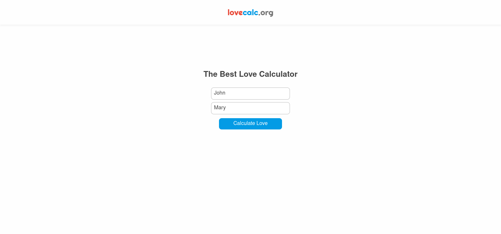
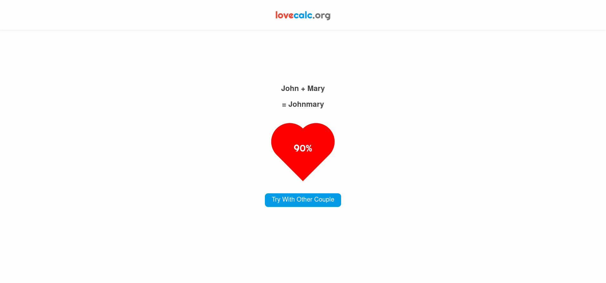

# Lovecalc

Lovecalc is the first version of [Amorometro](https://github.com/callsamu/amorometro), 
a simple application which takes two person names and displays a seemingly random percentage 
(obtained by hashing the sum of the hash of both names and dividing by the maximum numeric 
value of the hash function). However, this version avoids javascript and doesn't perform any 
client-side computations, delegating everything to a Go server (built with the stdlib and helper packages) 
which sends the resulting html to the browser, that is, performs server side rendering. The server also 
caches the computations in a Redis instance. This approach proved to needless, since hash computations 
are quite fast, but at least it taught me to use the database.





## Running

In order to run the application or it's tests, you must have both docker and docker-compose installed.

```shell
# runs the application server
make run

# test 
make test
```
